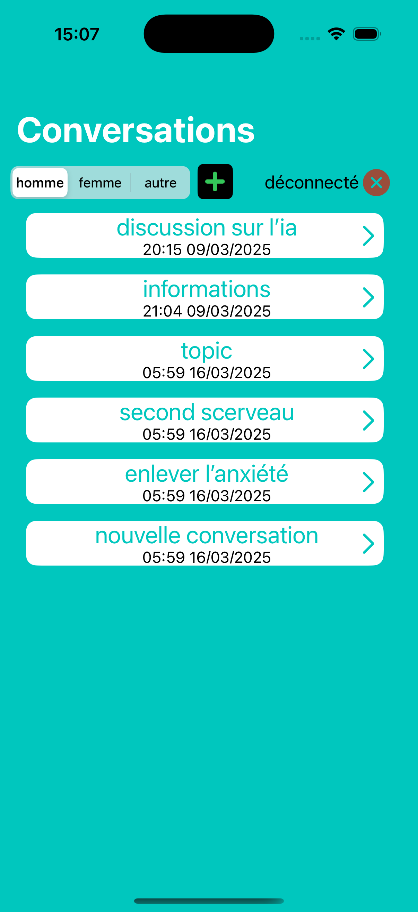
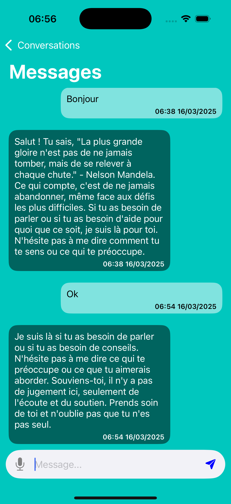
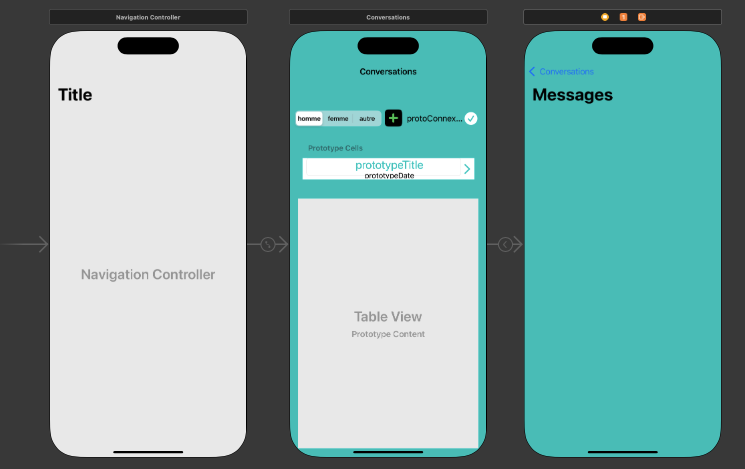

# ZenThea

###### projet L3 nec UPPA
<table align="center" width="100%">
    <thead>
        <tr>
            <th>
                
            </th>
            <th>
                projet de bot conversationnel avec un LLM distant (serveur) et/ou local
            </th>
        </tr>
    </thead>

</table>

## fonctionnement

- l'utilisateur créer des conversations
- l'utilisateur envoie des message au bot (envoie via le réseau ou non)
- il récupère ensuite la réponse et sauvegarde le tout localement

## Preview / appercut

### design pattern utilisés

- Mediator pour centralisés les objets pour que l'on sauvegarde (en local)(maintenabilité)
    les objets uniquement lorsque c'est nécéssaire
- Singleton pour la connexion (obligatoire dés que l'on a une BD (maintenabilité))
- DAO pour cécrocher la partie données de la base de données (obligatoire (maintenabilité))
- "observateur" pour mettre a jour a chaque modification les données dans l'app 

### autres informations

- LLM avec Mistral
